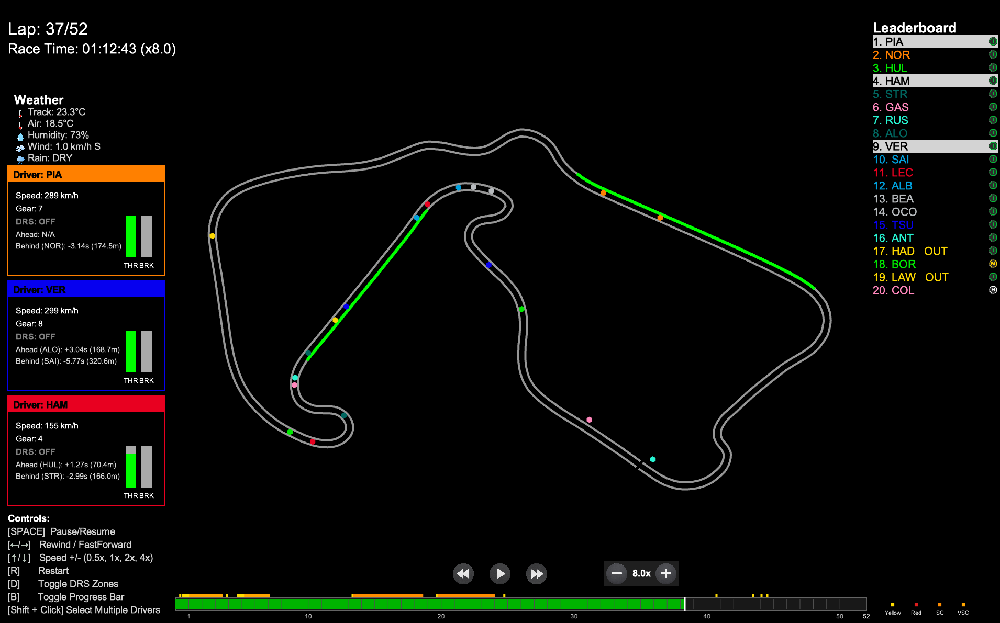

# F1 Race Replay & Outcome Predictor

A Python application for visualizing Formula 1 race telemetry, replaying race events, and **predicting race outcomes using machine learning**.



## Features

### Race Replay Visualization
- **Race Replay Visualization:** Watch the race unfold with real-time driver positions on a rendered track.
- **Leaderboard:** See live driver positions and current tyre compounds.
- **Lap & Time Display:** Track the current lap and total race time.
- **Driver Status:** Drivers who retire or go out are marked as "OUT" on the leaderboard.
- **Interactive Controls:** Pause, rewind, fast forward, and adjust playback speed using on-screen buttons or keyboard shortcuts.
- **Legend:** On-screen legend explains all controls.
- **Driver Telemetry Insights:** View speed, gear, DRS status, and current lap for selected drivers when selected on the leaderboard.

### ML Race Outcome Predictor
- **31 ML Features:** Qualifying, weather, historical performance, circuit characteristics, and driver form
- **XGBoost Model:** Industry-standard gradient boosting with ~4 position MAE
- **REST API:** FastAPI backend with automatic documentation
- **Interactive Dashboard:** Streamlit-based visualization with Plotly charts
- **Position Probability:** Confidence intervals and probability distributions for each driver

## Quick Start

### Installation

```bash
# Clone the repository
git clone https://github.com/yashpatil582/f1-race-replay
cd f1-race-replay

# Create virtual environment
python3 -m venv venv
source venv/bin/activate  # On Windows: .\venv\Scripts\activate

# Install dependencies
pip install -r requirements.txt
```

### Race Replay

```bash
# Launch GUI menu
python main.py

# Or use CLI
python main.py --cli

# Direct command
python main.py --viewer --year 2024 --round 12
```

### ML Predictor

```bash
# Train the model
python train_model.py

# Start API server
uvicorn api.main:app --reload

# Launch dashboard
streamlit run dashboard/app.py
```

## Architecture

```
+------------------------------------------------------------------+
|                    F1 Race Outcome Predictor                      |
+------------------------------------------------------------------+
|  Frontend (Streamlit)      |  Backend (FastAPI)                  |
|  - Race Selection          |  - /predict/{year}/{round}          |
|  - Prediction Dashboard    |  - /historical/{year}               |
|  - Feature Importance      |  - /model/info                      |
|  - Comparison Charts       |  - /schedule/{year}                 |
+------------------------------------------------------------------+
|                     ML Pipeline (src/ml/)                         |
|  - feature_engineer.py   : Extract 31 features from F1 data      |
|  - race_predictor.py     : XGBoost model with uncertainty        |
|  - data_collector.py     : Historical data aggregation           |
|  - model_evaluator.py    : Accuracy metrics & analysis           |
+------------------------------------------------------------------+
|                    Data Layer (FastF1 + Cache)                    |
|  - Historical race data (2022-2024) for training                 |
+------------------------------------------------------------------+
```

## ML Features (31 Total)

| Category | Features |
|----------|----------|
| **Qualifying** | grid_position, gap_to_pole, q3_reached, q2_reached, quali_pace_percentile, front_row, top_5_start, top_10_start |
| **Historical** | driver_avg_finish, driver_best_finish, driver_dnf_rate, driver_races_completed, driver_total_points |
| **Constructor** | constructor_avg_finish, constructor_best_finish, constructor_total_points |
| **Weather** | track_temp, air_temp, humidity, wind_speed, rain_probability, is_wet_race |
| **Circuit** | circuit_length, num_corners, overtake_difficulty, is_street_circuit, is_high_downforce |
| **Form** | last_5_avg, position_trend, consecutive_points_finishes, momentum_score |

## Model Performance

- **Validation MAE:** ~4.06 positions
- **Training Data:** 2023 season (22 races)
- **Model Type:** XGBoost Regressor

## API Endpoints

| Endpoint | Method | Description |
|----------|--------|-------------|
| `/predict/{year}/{round}` | GET | Predict race finishing positions |
| `/historical/{year}` | GET | Get historical predictions vs actual |
| `/model/info` | GET | Model metrics and feature importance |
| `/model/train` | POST | Train model on specified years |
| `/schedule/{year}` | GET | Get race schedule for a season |
| `/health` | GET | Health check endpoint |

API documentation available at `http://localhost:8000/docs` when running.

## Controls (Race Replay)

- **Pause/Resume:** SPACE or Pause button
- **Rewind/Fast Forward:** Left Arrow / Right Arrow or buttons
- **Playback Speed:** Up Arrow / Down Arrow (cycles 0.5x, 1x, 2x, 4x)
- **Set Speed Directly:** Keys 1-4
- **Restart:** R key
- **Toggle DRS Zone:** D key
- **Toggle Progress Bar:** B key
- **Toggle Driver Names:** L key
- **Select Driver:** Click on leaderboard (Shift+Click for multiple)

## File Structure

```
f1-race-replay/
+-- main.py                    # Race replay entry point
+-- train_model.py             # ML model training script
+-- requirements.txt           # Python dependencies
+-- README.md                  # Project documentation
+-- LICENSE                    # MIT License
|
+-- api/                       # FastAPI backend
|   +-- main.py                # API endpoints
|   +-- schemas.py             # Pydantic models
|
+-- dashboard/                 # Streamlit dashboard
|   +-- app.py                 # Interactive dashboard
|
+-- src/
|   +-- ml/                    # ML pipeline
|   |   +-- data_collector.py  # F1 data collection
|   |   +-- feature_engineer.py # Feature extraction
|   |   +-- race_predictor.py  # XGBoost model
|   |   +-- model_evaluator.py # Evaluation metrics
|   |
|   +-- f1_data.py             # Telemetry processing
|   +-- arcade_replay.py       # Race visualization
|   +-- ui_components.py       # UI components
|   +-- interfaces/            # Session interfaces
|   +-- lib/                   # Utilities
|
+-- models/                    # Trained models (gitignored)
+-- resources/                 # Preview images
+-- images/                    # UI assets
```

## Tech Stack

| Component | Technology |
|-----------|------------|
| ML Model | XGBoost, scikit-learn |
| API | FastAPI, Pydantic, Uvicorn |
| Dashboard | Streamlit, Plotly |
| F1 Data | FastF1, Pandas |
| Visualization | Arcade, Matplotlib |

## Qualifying Session Support (in development)

Recently added support for Qualifying session replays with telemetry visualization including speed, gear, throttle, and brake over the lap distance. This feature is still being refined.

## Contributing

There have been several contributions from the community that have helped enhance this project. See [contributors.md](./contributors.md) for acknowledgments.

If you would like to contribute:
- Open pull requests for UI improvements or new features
- Report issues on GitHub
- See [roadmap.md](./roadmap.md) for planned features

## Known Issues

- The leaderboard appears to be inaccurate for the first few corners of the race. The leaderboard is also temporarily affected by a driver going in the pits. At the end of the race, the leaderboard is sometimes affected by the drivers' final x,y positions being further ahead than other drivers. These are known issues caused by inaccuracies in the telemetry and are being worked on for future releases.

## License

This project is licensed under the MIT License - see the [LICENSE](LICENSE) file for details.

## Disclaimer

No copyright infringement intended. Formula 1 and related trademarks are the property of their respective owners. All data used is sourced from publicly available APIs and is used for educational and non-commercial purposes only.

---

Built with love by [Yash Patil](https://yashpatil582.github.io)
